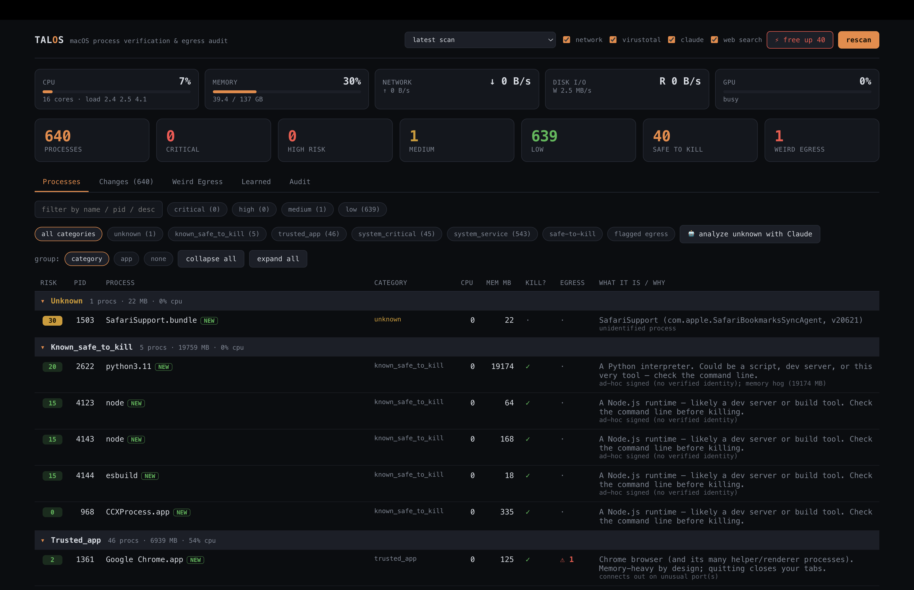

# Talos

Audit **every** running process on macOS: figure out what it is, what it's for, what it's
talking to over the network, how risky it is, and whether you can safely kill it — then
optionally reap the harmless ones. Repeatable CLI, a backend API, and a React portal.

**Talos is a macOS process auditor and cleanser.** It doesn't just list processes — it
**identifies** each one cryptographically, **scores** its risk, **monitors** its network
egress, and **optionally kills** the safe ones. A single command gives you a grouped risk
report; the React portal gives you a live dashboard.



## Quick start

```sh
make setup          # install Python + JS deps
uv run talos scan   # grouped risk report (or `make run`)
make dev            # API + React portal + open browser
```

## How it decides what a process is

For each process it climbs a **cheapest → most expensive identity ladder**, stopping as
soon as a layer is confident:

1. **Code signature & notarization** (`codesign` / `spctl`) — local, authoritative. Tells
   us *who made the binary*: Apple system, notarized Developer ID, ad-hoc, or unsigned.
2. **Curated known-process DB** (`talos/data/known_processes.yaml`) — the
   plain-English "what is this / what's it for", with a `safe_to_kill` flag.
3. **VirusTotal** hash reputation (optional, `--vt`, needs `VT_API_KEY`) — cached on disk,
   self-throttled to the free tier's 4 req/min.
4. **Claude** (optional, `--llm`) — only for processes the cheaper layers can't identify.
   Verdicts are cached back into the knowledge layer so you pay once per binary.

It then scores **risk 0–100** (signature trust + identity + egress reputation + privilege
+ resource use), groups processes by category, and flags **weird egress** — per-process
outbound connections resolved to org/ASN and checked for unusual ports / raw-IP
destinations.

> **Impersonation detection:** If a process claims a protected system name (e.g. `launchd`)
> but its binary is **unsigned**, Talos flags it as `suspicious (impersonation)` — because
> genuine Apple binaries are always signed. See
> [`VERIFICATIONS.md`](VERIFICATIONS.md) for the full classification rules.

## Memory & learning

The tool remembers what it figures out, in `~/.talos/learned.json`:

- **Every analysis is recorded** (description, category, SHA-256, first-seen / last-analyzed
  date). An expensive LLM verdict for, say, `fairplayd` is remembered — future scans show
  the same description without re-asking and without re-flagging it.
- **Acknowledge / do-not-kill list.** Tell it "I know what this is, leave it alone" and that
  decision is authoritative and persists across restarts. Keyed by binary path so it sticks.
  - CLI: `talos ack <pid>` / `talos forget <pid>` / `talos learned`
  - Portal: the ✓ acknowledge button in the detail drawer
  - API: `POST /acknowledge`, `POST /unacknowledge`, `GET /learned`
- **Group auto-analysis with Claude.** Identify a whole risk group at once instead of
  one-by-one. Processes are sent to Claude in **chunks (~12) as a list, and Claude returns a
  JSON list** — cheaper and less prone to hallucination than one call each. Optionally let
  Claude **search the web** for binaries it doesn't know.
  - **Uses Claude Code headless mode by default** (`claude -p`) — your existing Claude login,
    **no API key needed**. Falls back to the Anthropic API (`ANTHROPIC_API_KEY`) only if the
    `claude` CLI isn't installed. Force with `Settings.llm_backend = "headless" | "api"`.
  - CLI: `talos analyze --category unknown [--web-search]`
  - Portal: "🤖 analyze \<group\> with Claude" (+ a `web search` toggle)
  - API: `POST /analyze-group {category|tier|pids, web_search}`

## Safety

Conservative by design — safety is tested, not just asserted:

- **Dry-run by default.** Nothing is killed unless you pass `--no-dry-run` (CLI) /
  `confirm: true` (API).
- **Hardcoded protected list** (`launchd`, `kernel_task`, `WindowServer`, … and PID 0/1)
  that *nothing* can terminate — not even `--force`.
- `--auto-terminate-safe` only touches processes classified **safe-to-kill** with high
  confidence; malicious finds are flagged for review, never auto-killed.
- **Never kills itself** (matched by PID + cmdline).
- **Impersonation detection:** a protected-name process with an **unsigned** binary is
  flagged `suspicious` (source: `impersonation`), not trusted — genuine system binaries are
  always signed.
- Every termination (real or dry-run) is appended to `~/.talos/audit.log`.
- **Graceful degrade without sudo** — works on your own processes; warns about what's
  hidden. Run with `sudo` for full system-wide visibility.

> Safety rules are tested in [`tests/test_safety.py`](tests/test_safety.py) — protected
> names are never killable (even with `--force`), dry-run never kills, unsigned processes
> score higher than trusted ones, and impersonation is correctly detected.

## Install / build

```sh
make setup          # install Python (uv) + portal (npm) deps
make build          # → produces a standalone binary at dist/talos
make install        # installs it to /usr/local/bin/talos   (PREFIX=… to change)
```

(No build needed for development — just use `uv run talos …`.)

## CLI

```sh
talos scan                              # grouped risk report
talos scan --group-by app               # group helpers under their parent app
talos scan --json report.json           # machine-readable export
talos scan --llm --vt                   # enable Claude fallback + VirusTotal
talos scan --auto-terminate-safe        # dry-run: list what *would* be killed
talos scan --auto-terminate-safe --no-dry-run --yes   # actually reap them

talos inspect <pid>                      # deep dive: signing, egress, verdict
talos terminate <pid>                    # guarded kill (dry-run unless --no-dry-run)
talos audit                              # show the termination log
talos analyze --category unknown         # auto-analyze a whole group with Claude
talos serve                              # launch the backend API (port 58789)
```

Claude access uses **Claude Code headless mode** (`claude -p`) by default — no API key, just
your existing login. `ANTHROPIC_API_KEY` is only used as a fallback if the `claude` CLI isn't
installed. Env vars: `VT_API_KEY` (VirusTotal), `ANTHROPIC_API_KEY` (LLM fallback).
`--llm-model` overrides the model for the API path.

## Backend API + portal

```sh
make dev            # ← one command: API + portal + opens the browser
# or run them separately:
make serve          # FastAPI on http://127.0.0.1:58789  (docs at /docs)
make portal         # React portal on http://localhost:58790
```

Ports are deliberately uncommon (58789 / 58790) so they don't collide with every other
dev server squatting on 5173 / 3000 / 8080. Override with `talos dev --api-port
--portal-port`.

A **live system resource bar** (CPU, memory, network, disk I/O, and — with sudo — GPU, polled
from `GET /system`) sits at the top. The process table shows **per-process CPU and memory**,
and is **grouped collapsibly** (by category or app) so ~1000 mostly-system processes aren't a
wall of rows — the big benign groups start collapsed. *(Per-process network/disk/GPU aren't
exposed by macOS without elevated tooling — see `docs/enhancements.md`; the resource bar is
system-wide.)*

Everything the CLI/API can do is in the browser. Tabs: **Processes** (risk dashboard,
risk-tier + category filters, detail drawer with acknowledge + guarded terminate, **⚡ free
up** one-click reap with grouped preview, **🤖 group analysis with Claude**), **weird egress**
(per-process flagged outbound connections), **learned** (the remembered/acknowledged store,
with forget), and **audit** (termination history). **Scans stream over SSE** (`GET /scan/stream`) — rows fill the
dashboard live as each process is classified, with a progress bar naming the current item;
group analysis streams completed results the same way. The page never just goes blank.

**Scans persist** to `~/.talos/scans/` and survive a backend restart (the portal
reloads the latest on open). A **history dropdown** lets you view any previous scan, and a
**changes** tab diffs the current scan against the previous one — **active** (still running),
**new** (not in the previous list), and **inactive** (ended) — using `(pid, create_time)` so a
recycled PID is never mistaken for the same process. Point it at a non-default API with
`VITE_API_URL`.

Key endpoints: `POST /scan`, `GET /report`, `GET /processes`, `GET /process/{pid}`,
`GET /egress`, `POST /terminate`, `POST /reap`, `POST /analyze-group`, `POST /acknowledge`,
`GET /learned`, `GET /audit-log`.

## Tests

Safety tests (`tests/test_safety.py`) build `ProcessInfo` objects directly — no live processes,
no sudo needed. They verify:

- Protected names are **never** killable (even with `--force`)
- `--dry-run` never actually kills
- Malicious processes are never `safe_to_kill`
- Unsigned binaries score higher risk than trusted ones
- Protected-name processes with unsigned binaries are flagged as `impersonation`
- Talos never flags or kills itself
- The knowledge base loads and matches correctly

## Architecture

```
  CLI / Portal  →  FastAPI  →  engine.scan()  →  processes
                                    │
                              collect.py  (process enumeration)
                              signing.py  (code sig verification)
                              classify.py (identity ladder)
                              risk.py     (risk scoring)
                              network.py  (egress tracking)
                              llm.py      (Claude fallback)
                              actions.py  (guarded termination)
                              store.py    (learned knowledge)
                              history.py  (scan persistence + diffs)
```

The CLI and the API backend share the same `engine.scan()` — the portal is just a browser
front-end over the API.

## Roadmap

See [`docs/enhancements.md`](docs/enhancements.md) — notably live per-process bandwidth
(`nettop`) to catch high-volume exfil, a persistence/autostart audit, and historical
tracking with egress alerting.
